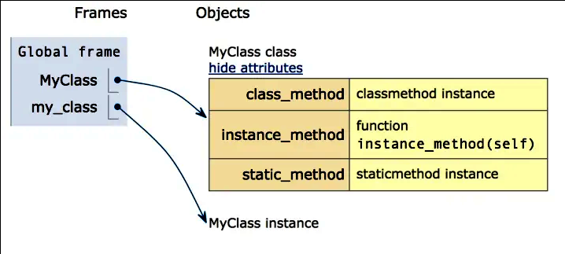
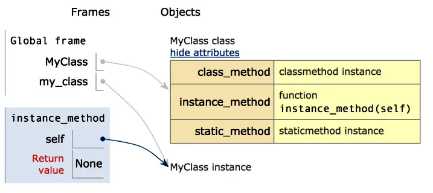
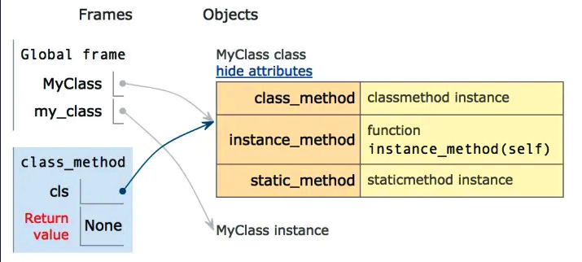
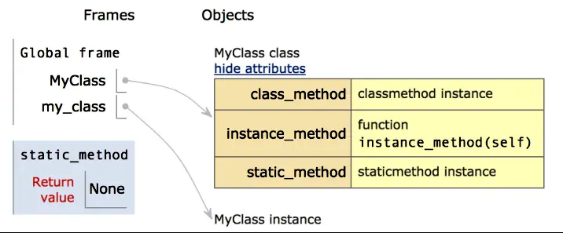

# python 基础

## 局部与全局

声明全局变量 `global`

## 数据存储

### 列表

变量 = [数据1,数据2]  
变量[索引]  

基本：

|方法|说明|
|:--|:--:|
|列表名.index(值)|输入列表值取索引|
|列表名[索引]=数据|赋值|
|lea(列表)|统计元素|
|列表.count(数据)|统计数据出现的次数|

排序：

|方法|说明|
|:--|:--:|
|列表名.sort()|升序排序|
|列表名.sort(reverse=Ture)|降序排序|
|.reverse()|逆序，反转|

添加数据：

|方法|说明|
|:--|:--:|
|.insert(索引,数据)|在指定位置插入数据|
|.append(数据)|在末尾插入数据|
|.extend(列表名2)|追加列表2到列表|

删除：

|方法|说明|
|:--|:--:|
|.remove(数据)|删除指定数据|
|.pop(索引)|默认删除最后一个数据；删除指定索引的数据|
|.clear()|清除列表|
|del 列表[索引]|删除指定索引数据|

> del 关键字本质上是用来将变量送内存上删除

`range(start, stop[, step])`函数  

参数说明：

- start: 计数从 start 开始。默认是从 0 开始。例如range（5）等价于range（0， 5）;
- stop: 计数到 stop 结束，但不包括 stop。例如：range（0， 5） 是[0, 1, 2, 3, 4]没有5
- step：步长，默认为1。例如：range（0， 5） 等价于 range(0, 5, 1)

### 元组

- 与列表类似，但**元素无法修改**
- 元组表示多个元素组成的序列

变量 = (数据1,数据2,···)  
变量.[索引]

> 注意:定义一个元组时需要带个括号：a = (1,)

|方法|说明|
|:--|:--:|
|元组.index(数据)|输入数据查索引|
|元组.count(数据)|统计数据出现次数|
|len(元组)|统计个数|

转换命令：  

字符串也是可以直接转换的

|方法|说明|
|:--|:--:|
|tuple(列表)|转换为元组|
|list(元组)|转换为列表|

#### 函数的返回

如果由**多个数据**的返回值，return 使用**元组**返回（小括号可以省略）,接收使用与返回相等的变量接收

交换两个变量:

```python
a,b = (b,a)     # 小括号可以去掉
# 等价于
# c = a
# a = b
# b = c
```

### 字典

键 `key` 是索引，只能由`字符串`,`数字`,`元组`构成  

值 `value` 是数据,可以取任何类型

变量 = {key1:value,key2:value2,···}  

变量.[key2]

基本操作：

|方法|说明|
|:--|:--:|
|字典[key] = value|修改键值|
|字典.pop(key)|删除指定key的数据|
|len(字典)|统计个数|
|字典.update(字典2)|合并字典，如果存在相同键会覆盖|
|字典.clear()|清空字典|

### 字符串

变量 = "数据"
变量[索引]

基本：

|方法|说明|
|:--|:--:|
|len(字符串)|统计长度|
|字符出.count(小字符串)|统计小字符串在字符串出现的次数|
|字符串.index(小字符串)|小字符串在字符串中第一次出现的位置|

判断：

|方法|说明|
|:--|:--:|
|.isspace()|是否只有空白字符|
|.isalnum()|是否字符全部包含数字或字母|
|.isalpha()|是否字符串全部包含字母|
|.isdecimal()|是否全部包含数字|
|.isdigit()|是否全部包含数字（全角、unicode字符串）|
|.isnumeric()|是否全部包含数字（全角、汉字数字、unicode字符串）|
|.istitle()|是否标题话（单词大写）|
|.islower()|是否全部小写|
|.isupper()|是否全部大写|

查找与替换：

|方法|说明|
|:--|:--:|
|.startswith(str)|是否以str开头|
|.endswith(str)|是否已str结束|
|.find(str[,start = 0, end = len(string)])|检测str是否在字符串中，start与end是范围，默认全范围|
|.rfind(str[,start = 0, end=len(string)])|与.find()类似，不过是从右边开始查询|
|.index(str[,start = 0, end=len(string)])|与.find()类似，只不过str不存在会**报错**|
|.rindex(str[,start = 0, end=len(string)])|与.index()类似，不过是从右边开始的|
|.replace(old_str,new_str[,num])|替换字符串，如果指定num，表示替换num次|

> 注意：replace方法执行后会返回一个新字符串，不会修改原内容

文本对齐：

|方法|说明|
|:--|:--:|
|.ljust(width)|左对齐，使用英文空格填充至width长度|
|.rjust(width)|右对齐，英文空格填充，width长度的字符串|
|.centun(width[, fillchar])|居中，使用fillchar表示自定义字符串填充|

去除空白字符：

|方法|说明|
|:--|:--:|
|.lstrip()|去掉左边的空白字符|
|.rstrip()|去掉右边的空白字符|
|.strip()|去掉两边的空白字符|

拆分与连接：

|方法|说明|
|:--|:--:|
|字符串.**split**([str = 字符串2, num])|默认以空白字符拆分字符串，str以字符串2为分界拆分字符；num拥有时拆分num+1次，返回一个**列表**|
|字符串.partition(str)|将字符串分成三层的**列表**，str前面的字符串,str字符串,str后面的字符串|
|字符串.rpartition(str)|与.partition(str)类似，但是是从**右边**开始查找str|
|字符串.splitlines()|按照\r,\n,\r\n分割，返回一个列表,处理文章|
|str.join(字符串列表)|以str为分隔符,将字符串列表合并|
|str.format(多个字符串)|格式化代替字符串|

```python
# 合并示例：
print(' and '.join(['Mary','John','Amy']))  # ---> Mary and John and Amy
print(' 你和{}和{}'.format('我','他'))       # ---> 你和我和他
```

[字符串格式化](./python_format.md)

### 切片

使用索引值来分割，适用于**字符串**、**列表**、**元组**  
格式：`字符串[开始索引:结束索引[:步长]]`

### 公共方法

|方法|说明|
|:--|:--:|
|len(item)|统计|
|del(item)|删除|
|max(item)|最大值|
|min(item)|最小值|
|cmp(item,item2)|比较两个值|

> cmp python3中已经取消

运算符：

|运算符|表达式|结果|说明|支持类型|
|:--:|:--:|:--:|:--|:--|
|`+`|[1,2]+[3,4]|[1,2,3,4]|合并|非字典|
|`*`|`[1]*2`|[1,1]|重复|非字典|
|`in`|3 in range(4)|True|是否存在||
|`not in`|3 in range(3)|True|是否不存在||
|`>,>=,==,=<,=<`|(1,2)<(2,2)|True|比较|非字典|

> 注意：in 对字典操作时，判断字典的key

## 函数

### 省略参数：  

如果想为参数指定默认值，可以在接收时建立，示例：

```python
def info(name, gender=True)：
    ···

info("xiaoming")
```

### 多个参数

- 参数名前面添加`一个*`可接收`元组`
- 参数名前面添加`两个*`可接收`字典`
- 再给多个参数命名时，习惯使用：
    - *args---存放元组
    - **kwargs---存放字典

示例：

```python
def demo(name, *args, **kwargs):
    ···
    
# 1存放在name中，2，3存放在元组中，后面两个name与age存放在字典中
demo(1,2,3,name='fasfd',age=11)
```

### 拆包

调用多值参数时使用变量，可以使用拆包

```python
def demo(*args, **kwargs):
    ···

gl_nums = (2,34)
gl_dict = {"name":"xiaoming","age"=18}
demo(*gl_nums,**gl_dict)
```

### 从函数中返回函数

其实并不需要在一个函数里去执行另一个函数，我们也可以将其作为输出返回出来：

```python 
def hi(name="yasoob"):
    def greet():
        return "now you are in the greet() function"
 
    def welcome():
        return "now you are in the welcome() function"
 
    if name == "yasoob":
        return greet
    else:
        return welcome
a = hi()    # 执行hi()  如果换成hi()()便会执行hi()中的greet()函数
print(a)
#outputs: <function greet at 0x7f2143c01500>
#上面清晰地展示了`a`现在指向到hi()函数中的greet()函数
#现在试试这个
print(a())
#outputs: now you are in the greet() function
```

当把一对小括号放在后面，这个函数就会执行；然而如果你不放括号在它后面，那它可以被到处传递，并且可以赋值给别的变量而不去执行它。 你明白了吗？让我再稍微多解释点细节。

当我们写下 `a = hi()`，`hi()` 会被执行，而由于 name 参数默认是 yasoob，所以函数 greet 被返回了。如果我们把语句改为 `a = hi(name = "ali")`，那么 welcome 函数将被返回。我们还可以打印出 `hi()()`，这会输出 *now you are in the greet() function*。

### 将函数作为参数传给另一个函数

```python
def hi():
    return "hi yasoob!"
def doSomethingBeforeHi(func):
    print("I am doing some boring work before executing hi()")
    print(func())
doSomethingBeforeHi(hi)
#outputs:I am doing some boring work before executing hi()
#        hi yasoob!
```

### 修饰器

[修饰器具体使用](./python_Decorators.md)

## 面向对象

**类名.属性 --> 类属性**  

> 推荐使用上述方法来访问对象的属性，不推荐使用 **对象.类属性**

```python
class tool(object):
    count = 0
    def __init__(self,name) :
        self.name = name
        tool.count += 1
        
tool1 = tool("123")
tool2 = tool("3222")
print(tool.count)   ## 返回 2
```

**类名.方法 --> 类方法（cls）**  

**类名() --> init定义实例属性**  

**对象名.方法名() --> 实例方法(self)**   

### 类方法

格式：

```python
@classmethod
def 类方法名(cls)
    pass
```

> 注意：类方法需要传入cls参数

可以通过 `cls` 访问类的属性、类的其他方法

### 静态方法

格式：

```python
@staticmethod
def 静态方法名()
    pass
```

通过 `类名.静态方法` 调用，无需创建对象

### 实例方法、类方法、静态方法对比

有以下类定义三个方法：

```python
class MyClass(object):
    # 实例方法
    def instance_method(self):
        print('instance method called', self)
    
    # 类方法
    @classmethod
    def class_method(cls):
        print('class method called', cls)
    
    # 静态方法
    @staticmethod
    def static_method():
        print('static method called')

my_class = MyClass()        # 实例化
my_class.instance_method()  # 实例方法
my_class.class_method()     # 类方法
my_class.static_method()    # 静态方法

```

1. 当实例化时，my_class指向实例化对象：  



2. 当调用实例方法(instance method)时，self参数指向的是刚刚实例化出的my_class实例对象:  



3. 当调用类方法(class method)时，cls参数指向的是一开始定义的MyClass类对象（注意不是实例对象）：  



4. 当调用静态方法(static method)时：  

  
通过类对象调用静态方法时，这里的结果与通过实例对象调用是完全一样的。通过实例对象调用静态方法时，实例对象也会被忽略，而是通过其类对象进行调用，这一点与类方法的调用是一样的。

> 注意：不管self参数，还是cls参数，都是一种约定俗成的用法，其实是可以使用其他的参数名代替。但是不建议使用其他参数名，毕竟代码不是只是写给自己看的。

### 魔法方法

使用 `dir(对象)` 方法可以查询对象包含的方法和属性。  

|方法名|说明|
|:--:|:--|
|`__new__`|*创建*对象时，会被*自动*调用|
|`__init__`|对象被*初始化*时，会被*自动*调 用|
|`__del__`|对象被从内存中*销毁*时，会被*自动*调用|
|`__str__`|返回*对象的描述信息*，`print()`输出使用|
|`__file__`|查看 *模块的完整路径*|
|`__name__`|显示模块名，如果时当前执行程序为 `__main__`|

#### `__new__` 方法

- `__new__` 是一个由 `object` 基类提供的 `内置静态方法` 作用：
    - 使用 `类名()` 创建对象时，python解释器 `首先` 调用 `__new__` 方法为对象分配空间。
    - `返回` 对象的引用
    - python获得引用后，将引用 `第一参数` 传给 `__init__` 方法

```
    player = MusicPlayer()
      .            .
     /|\          /|\                   ___________________
      |            |                    |   MusicPlayer   |
________________   |                    |   __new__(cls)  |
|  __new__     |   |                    |   __init__(self)|
|1. 为对象分配空|______________          ___________________
|2. 返回对象引用|  __init__   |
---------------|1.对象初始化  |
               |2.定义实例属性|
                --------------
```

对 `__new__` 方法的重写 需要 `return super().__new__(cls)`
否则，python得不到分配的 `引用对象` ，就不会调用对象的初始化方法

> `__new__` 是一个 静态方法 在调用时 `主动传递` cls参数

```python
class MusicPlayer(object):
    instance = None     # 记录对象引用
    def __new__(cls,*args,**kwargs):
        # 判断是否为空
        if cls.instance is None:
            # 调用父类方法
            cls.instance = super().__new__(cls)
        return cls.intance
```

#### 只执行一次初始化动作

- 每使用 `类名()` 创建对象时，都会自动调用两个动作。
- 前一个对 `__new__` 方法改造后，每次都会传递到 `第一次创建对象的引用`
- 初始化方法还会被再次调用

方法：

```python
···
class MusicPlayer(object):
    init_flag = False       # 标记是否 执行初始化动作
    ···
    def __init__(self):
        if MusicPlayer.init_flag:
            print("初始化")
            MusicPlayer.init_flag = True
    ···
```

### 身份运算符

|方法名|说明|
|:--:|:--|
|`is`|is 是判断两个标识符是不是引用同一个对象|
|`is not`|判断是不是引用不同对象|
> x is y 类似与id(x)==id(y),身份标识符用于比较两个对象内存地址是否一致

### 继承

```python
Class 类名(父类名):
    super.方法名()  # 重写方法
```
在 python3.x ，不指定父类，会默认使用object  
在 python2.x ，不指定父类，便没有

## 异常

捕获异常格式：

```python
try:
    尝试执行的代码
except  错误类型1:
    出现错误的处理
except 错误类型2:
    针对错误类型2，对应的处理
except Exception as result:
    # 捕获未知错误
    print("未知的错误%s" % result)
else:
    没有异常才会执行的代码
finally:
    无论是否有异常都会执行的代码
```

### 主动抛出异常

python 提供一个 `Exception` 异常类，使用 `raise` 关键字抛出异常
实例：

```python
def input_Passsword():
    pund = input("请输入密码")
    if len(pund) >= 8:
        return pund
    print("异常")
    ex = Exception("密码长度不够")
    raise ex

try:
    print(input_Passsword())
except Exception as result:
    print(result)
```

## 模块的使用

### 模块的导入

格式：  
`import 模块名 as 模块别名`导入模块 或者  
`from 模块名 import 工具名 as 别名`从模块导入某个工具

> 如果两个模块存在 *同名函数* ，那么 *后导入的函数* 会 *覆盖前导入的函数*

`from 模块名 import *` 导入模块中的全部工具

### 模块的搜索顺序

导入模块时：
- 搜索 `当前目录` 指定模块名文件 `如果有便直接导入`
- 如果没有，在搜索 `系统目录`

`__file__` 查看 *模块的完整路径*

### 开发原则

- 一个 *独立的* python *文件* 就是一个模块  
- 在导入文件时，文件中 `所有没有任何缩进的代码都会被执行`

### `__name__` 属性

- `__name__` 是python内置属性，记录着字符串
- 如果 **是被其他文件导入** ，`__name__` 就是 *模块名*
- 如果 **是当前执行程序**， `__name__` 是 *`__main__`*

### 包

- 包是一个 *包含多个模块* 的 *特殊目录*
- 目录下有一个 **特殊文件** `__init__.py`
- 包名 *命名方式* 与变量名一致
- 使用 **`import 包名`** 一次性导入所有 *模块*

#### `__init__.py` 

要在外界使用 *包* 中的模块，需要在 `__init__.py` 中指定 *对外界提供的模块列表*

```python
# __init__.py
from . import 模块1
from . import 模块2
```

## 文件操作

|函数|作用|
|:--:|:--|
|open|打开文件，并返回文件操作对象|
|read|将文件内容读取到内存|
|write|将指定内容写入文件|
|close|关闭文件|

`open` 函数第一个参数是要打开文件名（文件区分大小写）

- 如果存在，返回文件对象
- 如果不存在，抛出异常

`read` 方法一次 读入 并 *返回* 文件的所有内容

`close` 方法关闭文件

- 如果忘记关闭，会 *造成系统资源消耗*

```python
file = open("README")
text = file.read()
print(text)
file.close()

# 上述代码也可以这么写，打开的文件会自动关闭
with open("README") as f:
    text = f.read()
    print(text)
```

### 文件指针

- `文件指针` 标记 `从哪个位置开始读取数据`
- 第一次打开文件，通常`文件指针指向文件开始的位置`
- 当执行 `read` 方法后，文件指针会移动到 `末尾`

### 文件打开方式

open 函数默认打开为*只读文件*

语法：  
`f = open("文件名", "访问方式:)`

|访问方式|作用|
|:--:|:--|
|`r`|以 **只读** 方式打开，文件指针将会放在开头|
|`w`|以 **只写** 方式打开。如果文件存在会被 **覆盖** ，否则创建新文件|
|`a`|以 **追加** 方式打开。如果文件存在，文件指针 **放在结尾**；否则创建新文件|
|`r+`|以 **读写** 方式打开。**文件指针** 放在 **开头** ，如果不存在，抛出异常|
|`w+`|以 **读写** 方式打开。 如果 *存在* 会被 **覆盖**。否则抛出异常|
|`a+`|以 **读写** 方式打开。如果 *存在* ，*指针* 放在 **结尾** ；否则创建文件|

> 注意：频繁移动指针，会影响读写效率，

### 按行读取文件

- `read` 方法默认把 `所有文件一次性读取到内存`
    - 如果文件太大，对内存占用非常严重
- `readline` 方法可以一次读取一行内容
    - 方法执行后，会把 **文件指针** 移动到下一行再次读取

示例：

```python
file = open("README")
while True:
    text = file.readline()
    if not text:
        break
    print(text)
file.close()
```

### 复制文件示例

```python
file_read = open("···")
file_write = open("···")
while True:
    text = file_read.readline()
    if not text:
        break
    file_write.write(text)
file_read.close()
file_write.close()
```

## eval 函数

`eval` 函数,将 `字符串` 当成 `有效的表达式` 来求值并返回 `计算结果`

示例：

```python
eval("1+1") # 2
typeleval("[1,2,3]")    # list
typeleval("{'name':'123','age':'23'}")  # dict
```

经典案例：

```python
input_str = input("请输入一个算式")
print(eval(input_str))
```

### 注意不要滥用eval()

eval()由安全隐患（与PHP类似，防止命令注入攻击）  
示例：

```python
# 在上面的计算器中执行：
__import__('os').system('ls')   # 这样会使用当前用户执行当前终端的代码
```
